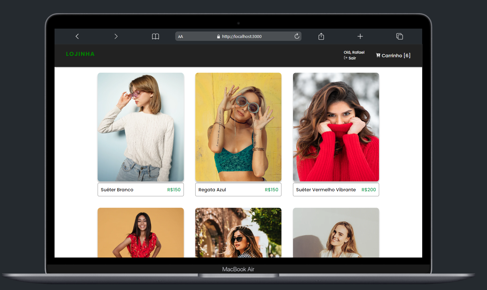
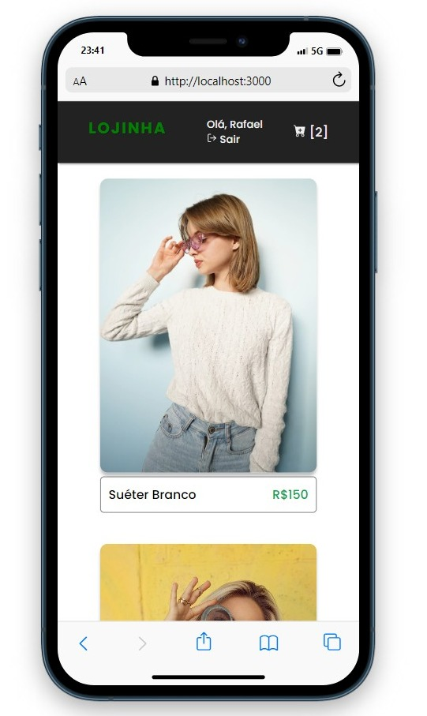

<strong>Lojinha</strong> é uma Projeto para estudo da ferramenta Redux 


<a id="tecnologias-utilizadas"></a>

## :rocket: Tecnologias Utilizadas

O projeto foi desenvolvido utilizando as seguintes tecnologias

- [React]()
- [TypeScript]()
- [Styled Components]()
- [Redux]()
- [Redux Toolkit]()
- [LocalStorage]()


## :heavy_check_mark: :computer: Imagem

<h1 align="center">
    
</h1>

<h1 align="center">
    
</h1>


## :heavy_check_mark: :computer: Video da Aplicação Mobile

<h1 align="center">
    
</h1>


<a id="como-usar"></a>

## :fire: Como usar
1. Faça um clone :

```sh
  $ git clone https://github.com/Rafael-Rufino/redux-guide
```

2. Executando a Aplicação:

```sh
  # Instale as dependências
  $ npm install 
  ou 
  $ Yarn

  # Inicie a aplicação web
  $ cd redux-guide
  $ yarn dev
```

<a id="como-contribuir"></a>


# :recycle: Como contribuir

- Faça um Fork desse repositório,
- Crie uma branch com a sua feature: `git checkout -b my-feature`
- Commit suas mudanças: `git commit -m 'feat: My new feature'`
- Push a sua branch: `git push origin my-feature`


## :memo: License

Esse projeto está sob a licença MIT. Veja o arquivo [LICENSE](LICENSE.md) para mais detalhes.

<h4 align="center">
    Feito com 💜 by <a href="https://www.linkedin.com/in/rafael-r-dos-santos/" target="_blank">Rafael Rufino</a>
</h4>


